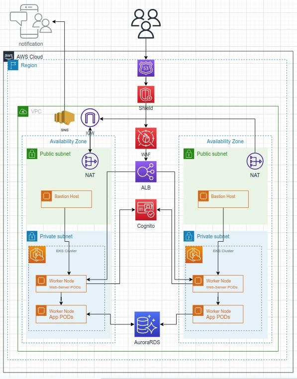

# Architecture Spec

# 

## Website

- I'll create new VPC in the nearest region to my customers (low latency)
- For high availability i'll multi zone arch
- Use of R53 to store the website address [pizza.hiredscore.com](pizza.hiredscore.com)
- Use of K8S cluster with `HPA` to be able the serve 10s of thousands of users
- Use of K8s `cluster-autoscaler` to support auto scale of the K8s nodes.
- K8s `cluster-autoscaler` used `AWS Auto scaling groups` service

## Persistence

- Use of Aurora RDS

## Notifications

- Use of AWS SNS service

## Security

- Use AWS Shield against DDOS Attacks.
- Create 2 subnets private and public.
- In the `public` subnet we will have:
  - ALB
  - Bastion server to login to the EKS Cluster
  - NAT gateway in order to have route from the private OUT to the internet
- In the `private` subnet we will have:
  - Aurora RDS
  - EKS Control plane and ETCD
  - EKS worker node which contains the app PODs
  - K8S worker node for web servers pods for incoming traffic which go through AWS WAF(firewall)

## Authentication

- Use of AWS cognito
